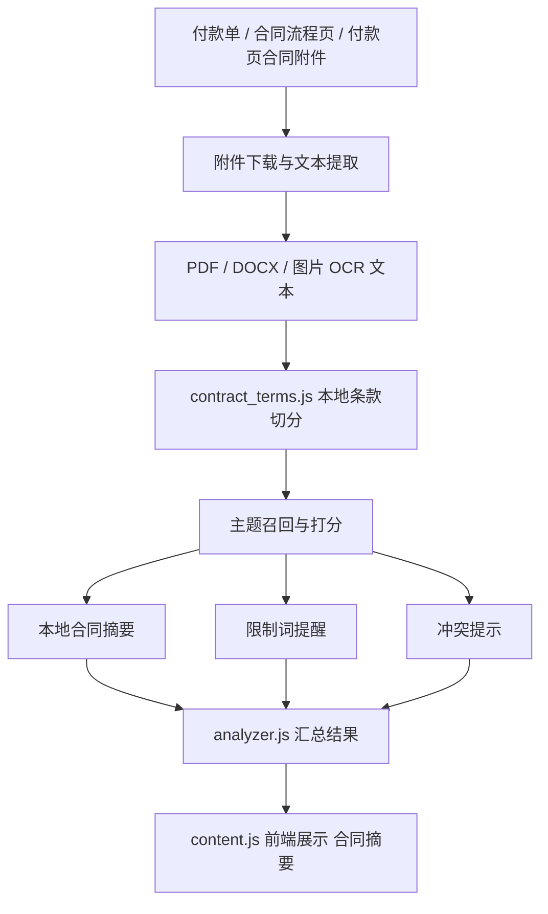

# 合同摘要与本地化现状

这份文档只讲当前真实状态：

- 当前版本的合同摘要已经关闭外部 AI
- 合同摘要现在完全走本地规则和附件文本提取
- 主题化条款证据包仍然是后续演进方向

## 当前结论

截至 `2026-04-11`：

- `外部 AI 合同摘要已关闭`
- `不再向外部模型发送脱敏条款候选`
- `合同摘要只使用本地规则生成`

也就是说，当前线上口径不再是：

- 脱敏后发给外部大模型

而是：

- 附件解析
- 条款切分
- 本地关键词召回
- 本地摘要与提醒

## 当前链路

当前合同摘要链路是：

1. 进入合同页或在付款页附件中发现合同来源
2. 下载合同附件
3. 读取 PDF / DOCX / 图片 OCR 文本
4. 本地筛付款相关候选条款
5. 本地生成合同摘要、限制提醒和冲突提醒
6. 前端展示“合同摘要”

## 当前架构图

## 当前本地规则做什么

本地规则主要负责：

- 识别付款相关条款
- 识别合同期限相关条款
- 识别合同类型
- 提取付款方式
- 提取付款时限
- 提取验收条件
- 提取发票条件
- 提取税率
- 提取金额上限
- 识别限制词和覆盖词
- 识别基础冲突信号

当前关键词和规则覆盖的合同类型包括：

- `物业租赁 / 水电物业`
- `买量投放 / 广告代理 / 渠道投放`
- `美术视频外包`
- `软件授权 / 订阅 / 技术服务`
- `软著 / 版权代理`
- `问卷调查 / 用户研究`

## 为什么先关外部 AI

这次关闭不是“功能退步”，而是产品边界收敛。

原因主要有三类：

### 1. 合规和安全边界更清晰

关闭后：

- 不再外发合同候选条款
- 不再依赖外部模型
- 不再保留外部模型 key

### 2. 当前主要问题不靠 AI 解决

近期真实回放里，最值得补的是：

- 补充协议 + 报价单 + 原合同引用
- 附件直读型合同
- 真实合同类型覆盖

这些都属于本地提取和规则设计问题，不是“模型不够聪明”的问题。

### 3. 审核产品更需要证据，而不是一句 AI 总结

财务审核更在意：

- 哪条条款被命中
- 有哪些限制条件
- 有没有冲突

而不是单纯看到一个“AI摘要”标签。

## 当前前端会显示什么

当前合同摘要区主要展示：

- 合同来源
- 识别类型
- 付款方式
- 付款条款摘要
- 验收条件
- 发票条件
- 税率
- 付款时限
- 分期安排
- 金额上限
- 账户变更要求
- 条款提醒

不再显示：

- 发送给 AI 的内容
- 大模型发送状态
- AI 摘要失败

## 当前状态和后续方向

当前状态：

- 本地合同摘要已经可用
- 外部 AI 已完全关闭

后续方向：

- 继续补强条款证据包
- 补强补充协议 / 报价单 / 原合同引用链路
- 如果未来重新引入模型，也只能作为可选辅助层，不作为当前默认链路

## 一句话口径

当前版本的合同摘要是 `纯本地规则版`，不是 `外部 AI 版`。
